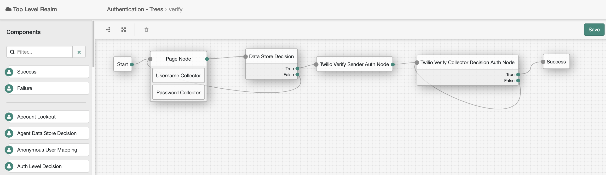

<!--
 * The contents of this file are subject to the terms of the Common Development and
 * Distribution License (the License). You may not use this file except in compliance with the
 * License.
 *
 * You can obtain a copy of the License at legal/CDDLv1.0.txt. See the License for the
 * specific language governing permission and limitations under the License.
 *
 * When distributing Covered Software, include this CDDL Header Notice in each file and include
 * the License file at legal/CDDLv1.0.txt. If applicable, add the following below the CDDL
 * Header, with the fields enclosed by brackets [] replaced by your own identifying
 * information: "Portions copyright [year] [name of copyright owner]".
 *
 * Copyright 2019 ForgeRock AS.
-->
# Twilio Verify Auth Nodes

An authentication node for ForgeRock's Identity Platform 6.0.0 and above which integrates the Twilio Verify service
 with AM. 

## Usage 

To deploy these nodes, download the jar from the releases tab on github 
[here](https://github.com/ForgeRock/Twilio-Auth-Tree-Nodes/releases/latest). Next, copy the jar into the 
../web-container/webapps/openam/WEB-INF/lib directory where AM is deployed. Restart the web container to pick up the 
new node. The node will then appear in the authentication trees components palette.

If you'd like to build the integration from source, the code in this repository has binary dependencies that live in
 the ForgeRock maven repository. Maven can be configured to authenticate to this repository by following the
  following [ForgeRock Knowledge Base Article](https://backstage.forgerock.com/knowledge/kb/article/a74096897).

### Twilio Verify Sender Auth Node Configuration
This node kicks off the Twilio Verify request via the configured channel to the users device. This node can
 also optionally request the identifier from the user to send the one-time password. By default, this node looks
  to the `userIdentifier` value in sharedState for the user identifier.
* **Account SID** - The unique string to identify the Account found in the Twilio account dashboard.
* **Authentication Token** - The authentication token found in the Twilio account dashboard.
* **Service SID** - The unique string to identify the Service in the Twilio account dashboard.
* **Channel** - The delivery channel that the OTP should be sent through. If the `Email` channel is specified,
 the Twilio Verify Service must be integrated with Sendgrid to send emails. Instructions on how to do that can be
found [here](https://www.twilio.com/docs/verify/email). If the `SMS` or `Call` channel is specified, the user
identifier must contain the country code and can optionally contain special characters. All special characters are
removed before the request is sent to Twilio. Valid identifiers would be: `+15553231234` or `1(555)323-1234`. Invalid
identifiers would be `(555) 323-1234` as the country code is not present.
* **Request Identifier** - Should the node request the identifier from the user or should it look to the `userIdentifier` value in shared state.

### Twilio Verify Collector Decision Auth Node Configuration
This node collects the one-time password from the user and validates that password against the Twilio Verify service.
* **Hide Code Text** - If enabled, hides the code text from the end user similar to a password collector.

 ### Example Flow
The example flow below validates the users username and password, asks the user for their phone number, and
sends a one-time password via SMS to that phone number. This is not a recommended flow for production use, but could
be altered to pull the users phoneNumber from their profile.
To deploy this flow via the [AM-treetool](https://github.com/jonknightfr/AM-treetool), run 
`cat Treetool/Twilio.json | amtree.sh -i verify -h https://{{AM_Domain}} -u amadmin -p {{admin_password}}`.

[forgerock_platform]: https://www.forgerock.com/platform/  
